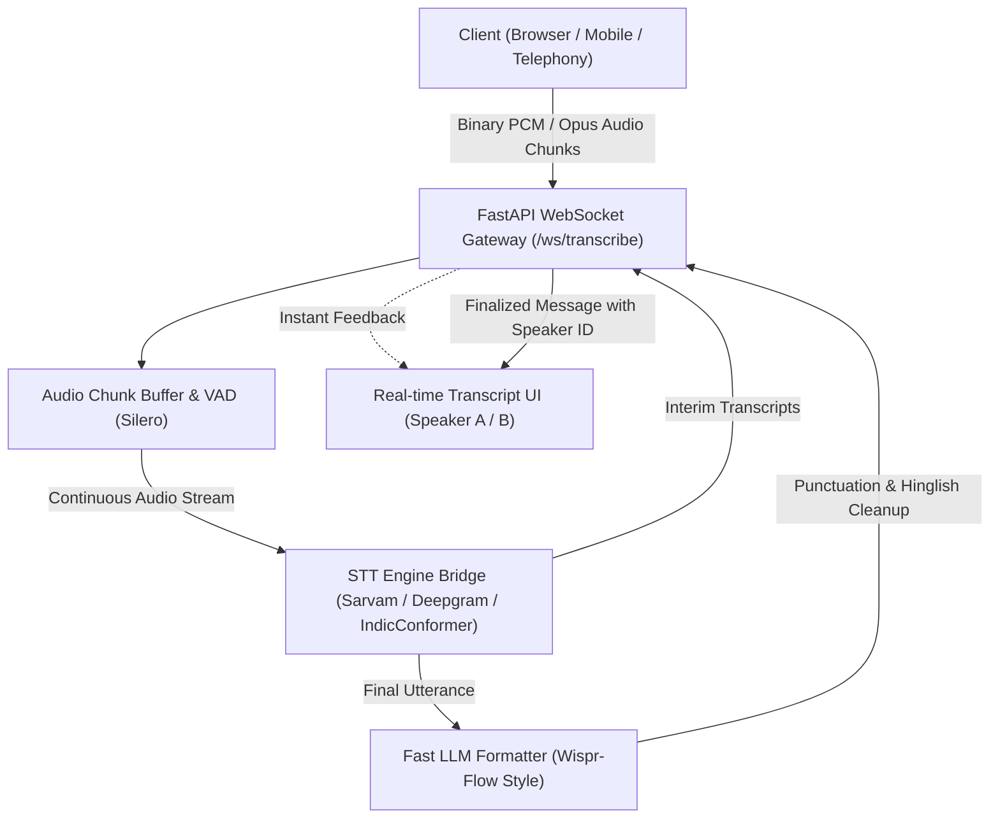

# Comprehensive Research Report: Speech-to-Text (STT) for Real-Time Hindi-English (Hinglish) Conversational AI

**Target Application:** 2-Person Conversational Speech-to-Text Engine  
**Backend Framework:** Python (FastAPI)  
**Target Linguistic Landscape:** India (English, Hindi, Code-Switched Hinglish, and Regional Dialects)  
**Document Location:** `document/speech_to_text_research.md`  

---

## 1. Executive Summary & Comparative Matrix

Transcribing natural conversations between two people in India presents unique acoustic and linguistic challenges:
1. **Intra-Sentential Code-Switching (Hinglish):** Speakers frequently shift between English and Hindi mid-sentence (e.g., *"Main kal aane wala tha but meeting cancel ho gayi, so let's reschedule"*).
2. **Script Ambiguity:** Output can be rendered in Devanagari, Latin script (Romanized Hinglish), or mixed script.
3. **Dialects & Accents:** Regional variants (Bhojpuri, Maithili, Awadhi, Haryanvi, Rajasthani) alter phonetics and vocabulary.
4. **2-Person Dynamics:** Turn-taking, overlapping speech (cross-talk), and speaker attribution (diarization).
5. **Real-time Latency:** Live streaming via WebSockets requires Time-To-First-Token (TTFT) < 300ms.

### Comparison Matrix

| Solution | Type | Hinglish Code-Switching | Streaming Latency | Dialect Support (Bhojpuri/Maithili/etc.) | 2-Person Diarization | Est. Cost / Hr | Key Strength / Fit |
| :--- | :--- | :--- | :--- | :--- | :--- | :--- | :--- |
| **Sarvam AI (Saaras v4)** | Managed API (India) | **Exceptional (Native)** | ~150–250ms (WebSocket) | **High** (Bhojpuri, Maithili, Awadhi native) | Built-in Diarization API | ~₹30 / hr (~$0.36) | **Best overall accuracy for Indian speech, dialects, and telephony** |
| **Deepgram (Nova-3 / Flux)** | Managed API (Global) | **Very Good** (`language=multi`) | **Exceptional** (<150ms) | Low to Moderate (Standardized Hindi + urban accents) | Native real-time diarization (`diarize=true`) | ~$0.26–$0.46 / hr | **Industry standard for ultra-low latency streaming & developer DX** |
| **AI4Bharat (IndicConformer)** | Open Source (Self-Hosted) | **Strong** | ~200–400ms (RNN-T streaming) | **High** (22+ languages, Bhashini ecosystem) | External (requires PyAnnote) | Free (requires GPU: ~$0.40–$1.00/hr) | **Complete data privacy, no vendor lock-in, open weights** |
| **faster-whisper + Hinglish Fine-Tune** | Open Source (Self-Hosted) | **Good to Strong** (with fine-tuned models) | ~400–800ms (chunked streaming) | Low (defaults to Hindi/phonetic hallucination) | External (PyAnnote) | Free (requires GPU: ~$0.50–$1.20/hr) | **Ecosystem flexibility, high offline accuracy, CTranslate2 speed** |
| **Google Cloud STT v2 (Chirp 3)** | Managed API (Global) | **Very Good** (Auto-detect `hi-IN` + `en-IN`) | ~300–600ms | Moderate (Broad Indic coverage, standard dialect mapping) | Native Diarization Config | ~$0.96–$1.44 / hr | **High enterprise reliability, GCP native** |
| **Gnani.ai (Prisma v2.5)** | Managed API (India) | **Exceptional** | Real-time WebSocket | **High** (Trained on 14M+ hrs Indian telephony & tier-2/3) | Built-in | Custom / Enterprise | **Specialized for Indian call centers and telephony-grade audio** |

---

## 2. Deep Dive: Top Managed Cloud Solutions (SaaS APIs)

### 2.1 Sarvam AI (`Saaras v4` / Legacy `Saarika`)
Sarvam AI is an Indian AI lab specifically founded to develop foundational models for Indian languages. Their flagship speech recognition model family is **Saaras** (currently v4; earlier iterations included Saarika v2.5).

*   **Code-Switching Capabilities:**
    *   Trained natively on conversational Indian speech where Hindi and English are mixed seamlessly.
    *   Offers multiple transcription modes: `codemix` (keeps English words in Latin script and Hindi in Devanagari or transliterated), `verbatim`, `translit`, and standard `transcribe`.
    *   Handles intra-word code mixing common in India (e.g., *"setting-baazi"*, *"driving-wala"*).
*   **Streaming & Latency:**
    *   Provides a native WebSocket API endpoint for real-time streaming audio ingestion.
    *   Time-To-First-Token (TTFT) is approximately **150ms**, making it suitable for live conversational applications.
*   **Dialect & Language Support:**
    *   Supports 22 official Indian languages.
    *   Directly models non-standard dialects such as **Bhojpuri, Maithili, and Awadhi**.
    *   Exceptional resilience to background noise, Indian street noise, and 8kHz/telephony-grade bandwidth.
*   **2-Person Conversation Features:**
    *   Speaker diarization is built-in.
*   **Pricing:**
    *   Extremely cost-effective: Base rate is approximately **₹30.00/hour** (~$0.36/hour), with ₹100 in free trial credits on sign-up.

### 2.2 Deepgram (`Nova-3` & `Flux General Multi`)
Deepgram is widely considered the global benchmark for developer experience, streaming throughput, and ultra-low latency.

*   **Code-Switching Capabilities:**
    *   **Nova-3 Multilingual:** Specify `model=nova-3&language=multi`. Nova-3 handles code-switching between 10 major languages, including Hindi and English.
    *   **Flux Multilingual (`model=flux-general-multi`):** Built specifically for conversational voice agents with native turn-taking, interruption detection, and dynamic language switching.
    *   **Keyterm Prompting:** You can pass `keyterm=UPI&keyterm=Aadhaar&keyterm=Chai` to dynamically boost recognition of domain-specific terms without model fine-tuning.
*   **Streaming & Latency:**
    *   Sub-150ms transcription latency via persistent WebSockets.
    *   Configurable endpointing (e.g., `endpointing=100` ms) to detect natural pauses between speakers.
*   **2-Person Conversation & Diarization:**
    *   Native real-time streaming diarization (`diarize=true`): Outputs `speaker: 0` or `speaker: 1` per word/utterance.
    *   Supports multi-channel audio natively (`multichannel=true`).
*   **Limitations to Watch:**
    *   **Hindi Numeral Formatting:** Automatic numeral formatting (converting spoken numbers like *"pachees"* or *"sau"* into digits `25` or `100`) is currently limited for Hindi in multilingual streaming mode.
    *   **Rural Dialects:** Performs best on standard Hindi (Khari Boli) and urban Hinglish. Heavy rural Bhojpuri/Maithili vocabulary may result in phonetic substitutions.
*   **Pricing:**
    *   Pay-as-you-go: ~$0.0043 to $0.0077 per minute (~$0.26 to $0.46 per hour).

### 2.3 Google Cloud Speech-to-Text V2 (`Chirp 3`)
Google's Speech V2 API includes **Chirp 3**, a 2B+ parameter multilingual foundation model trained on millions of hours of global speech.

*   **Code-Switching:** Configured via `language_codes=["hi-IN", "en-IN"]` with automatic language detection enabled.
*   **Strengths:** Unmatched acoustic coverage; handles thick Indian English accents gracefully.
*   **Weaknesses:** Higher streaming latency than Deepgram; significantly higher cost (~$0.96–$1.44/hour).

### 2.4 Gnani.ai (`Prisma v2.5`)
Gnani.ai is an established enterprise conversational AI player in India with deep telecom ties.

*   **Dataset:** Trained on 14+ million hours of proprietary Indic speech, specifically targeting call centers and rural India.
*   **Fit:** If your application operates over PSTN/telephony or requires high-accuracy dialect comprehension for rural customers, Gnani.ai is a major enterprise contender alongside Sarvam.

---

## 3. Deep Dive: Open Source & Self-Hosted Solutions

For deployments requiring 100% data residency, zero third-party API exposure, or offline capability, open-source models can be hosted directly inside your Python/FastAPI environment.

### 3.1 AI4Bharat / Bhashini (`IndicConformer` vs `IndicWhisper`)
AI4Bharat (IIT Madras) in collaboration with the Indian Government's **BHASHINI** initiative is the gold standard for open-source Indic AI.

#### 1. IndicConformer (Recommended for Streaming)
*   **Architecture:** Hybrid CTC / RNN-T (Conformer-based) built on NVIDIA NeMo.
*   **Streaming Advantage:** Because RNN-T decodes auto-regressively chunk-by-chunk without needing full 30-second context windows, **IndicConformer supports true real-time streaming** over WebSockets.
*   **Code-Switching:** Specifically trained on mixed Indic-English corpora. Capable of handling mid-sentence transitions without audio-splitting hacks.
*   **Resource Footprint:** Significantly lighter on GPU VRAM than large Transformer decoders (can run real-time on an NVIDIA T4 or RTX 4080/4090).

#### 2. IndicWhisper (Recommended for High-Accuracy Batch)
*   **Architecture:** Fine-tuned Whisper Large-v2 / v3 on 22 Indian languages.
*   **Advantage:** Superior grammatical coherence and punctuation.
*   **Disadvantage:** Standard Whisper architecture operates on 30-second sliding windows. Chunk-based streaming is heavier and introduces higher latency (~500ms+).

### 3.2 `faster-whisper` + Hinglish Fine-Tuned Weights
OpenAI's base Whisper models (`whisper-large-v3`, `turbo`) suffer from a well-known failure mode with Hinglish: **language token lock-in**. When Whisper identifies the language token as `<|en|>`, it forces English tokens (either ignoring Hindi words or transcribing them as gibberish phonetics). When locked to `<|hi|>`, it forces Devanagari script and attempts to translate English words.

#### Solution: Hinglish Fine-Tuned Checkpoints
Running via **`faster-whisper`** (CTranslate2 inference engine) with specialized weights:
*   `Trelis/whisper-hinglish-preview`: Fine-tuned to output mixed Devanagari and Latin script.
*   `Oriserve/Whisper-Hindi2Hinglish`: Whisper large-v3 fine-tuned on 550+ hours of noisy, Indian-accented speech.
*   **Inference Optimization:** CTranslate2 provides INT8 quantization, 4x inference speedup, and low VRAM consumption (~4GB VRAM for large-v3 quantized).

---

## 4. Reverse Engineering "Whisperflow" / Wispr Flow

The user observed: *"I have seen someone using Whisperflow and generating transcription, and there I saw it was able to switch between Hindi and English without any issue... look into how they are doing behind the scenes."*

### 4.1 Disambiguation
There are two products often confused:
1. **Wispr Flow (by Wispr AI):** The viral desktop/mobile dictation tool developed by Wispr AI.
2. **Whisper Flow (by Butterfly AI):** A voice keyboard mobile app.
3. **whisper-streaming / WhisperFlow open-source repos:** Community wrappers using Whisper + VAD.

The technology that captivated users with effortless Hinglish code-switching is **Wispr Flow**.

### 4.2 The Two-Stage Architecture Under the Hood
Wispr Flow does **not** simply pipe raw audio into a stock Whisper model. Their production architecture consists of a tightly integrated two-stage pipeline:

```
[ Microphone Audio Stream ]
            │
            ▼
┌──────────────────────────────────────────────┐
│ Stage 1: Ultra-Fast Acoustic ASR Engine      │
│  - Custom low-latency model ("Canto") or    │
│    fine-tuned Whisper on Indian Speech       │
│  - Preserves raw phonetics, no forced lang   │
│  - Latency: < 180ms                          │
└──────────────────────────────────────────────┘
            │ Raw, noisy, mixed-script tokens
            ▼
┌──────────────────────────────────────────────┐
│ Stage 2: Real-Time Downstream LLM Normalizer │
│  - Fast Small Language Model (SLM / Groq /   │
│    vLLM Llama-3.2-3B / Custom fine-tune)     │
│  - Removes fillers ("um", "uh", "matlab")     │
│  - Harmonizes script (Romanized or Dev)      │
│  - Corrects grammar & punctuation            │
│  - Latency: < 150ms                          │
└──────────────────────────────────────────────┘
            │ Clean, formatted Hinglish text
            ▼
[ Client Application UI / Chat Output ]
```

### 4.3 Why This Architecture Succeeds
1. **Separation of Concerns:** Speech recognition models are great at phonetics but struggle with contextual script formatting. LLMs are great at grammar and script normalization but cannot listen to audio.
2. **Prompt Priming:** The ASR engine is primed with Hinglish prefixes or allowed to emit both Latin and Devanagari tokens freely.
3. **Streaming Token Rewriting:** The downstream LLM processes the streaming tokens in real time, standardizing slang (e.g., converting *"kya bolte"* or *"scene kya hai"* into crisp Romanized text without phonetic glitches).

### 4.4 How You Can Replicate This in Your FastAPI App
You can recreate the "Wispr Flow effect" in your FastAPI backend:
1. Ingest audio stream via FastAPI WebSocket.
2. Send chunks to **Sarvam Saaras v4 WebSocket** or **Deepgram Nova-3 (`language=multi`)**.
3. Pipe the finalized chunk text through a low-latency LLM (e.g., Groq Llama-3.1-8B, Gemini 1.5 Flash, or a local vLLM instance) with a system prompt:
   > *"You are a Hinglish conversation formatter. Take this raw speech transcription, keep English words in English, transcribe Hindi words in clean Romanized script (or Devanagari depending on user setting), insert proper punctuation, remove stuttered fillers, and output only the cleaned text."*

---

## 5. Deep Dive: Handling Indian Dialects

India does not have a single "Hindi". The dialect continuum spans distinct linguistic systems:

### 5.1 The Dialect Spectrum
1. **Eastern Hindi / Bihari Zone:**
   *   **Bhojpuri:** ~50M+ speakers. Distinct verbal conjugations (e.g., *"ka karat baada?"* vs Hindi *"kya kar rahe ho?"*).
   *   **Maithili:** Official 8th Schedule language with rich literary history.
   *   **Awadhi:** Spoken in central/eastern UP (Lucknow, Ayodhya).
   *   **Magahi:** Spoken in Patna, Gaya, and southern Bihar.
2. **Western & Northern Zone:**
   *   **Haryanvi:** Heavy tonal inflections, altered consonant clusters.
   *   **Rajasthani (Marwari, Mewari):** Substantial vocabulary deviation from standard Hindi.
3. **Accent-Inflected Hindi:**
   *   South Indian Hindi (Dravidian phonetic transfer, unaspirated consonants).
   *   Bengali/Odia accented Hindi (vowel rounding).

### 5.2 Provider Capabilities on Dialects

| Dialect | Sarvam AI | Bhashini / AI4Bharat | Deepgram Nova-3 | OpenAI Whisper |
| :--- | :--- | :--- | :--- | :--- |
| **Bhojpuri** | **Full Native Support** | **Full Native Support** | Approximates to Hindi | Hallucinates / Fails |
| **Maithili** | **Full Native Support** | **Full Native Support** | Weak / Transcribes as Hindi | Poor |
| **Awadhi** | **Full Native Support** | **Full Native Support** | Moderate (Phonetic mapping) | Poor |
| **Haryanvi** | **High** | **High** | Moderate (Understands words) | Moderate |
| **Rajasthani** | **High** | **High** | Moderate | Poor |

### 5.3 Translation vs Direct Transcription
*   **Direct Transcription (Preferred):** Keeps the spoken words as uttered. Sarvam and Bhashini can directly transcribe Bhojpuri/Maithili into text.
*   **Translation to English (Fallback):**
    *   If downstream analytics or users only read English, an integrated ASR + Translation model is required.
    *   **Whisper:** Supports `task="translate"`, translating spoken Hindi/dialects directly to English. However, for Bhojpuri/Maithili, Whisper's translation hallucination rate is high.
    *   **Sarvam Mayura / IndicTrans2:** Sarvam or AI4Bharat's IndicTrans2 provides state-of-the-art machine translation specifically trained on Indian dialect sentence pairs.

---

## 6. Architecture for 2-Person Conversation Transcription

Transcribing a conversation between two people introduces challenges that do not exist in single-speaker dictation:

```
Speaker A (Client) ───┐
                      ├──▶ Overlapping Speech / Cross-talk?
Speaker B (Agent)  ───┘    Turn-taking? Who said what?
```

### 6.1 Input Channel Architecture: Stereo vs Mono

| Metric | Dual-Channel (Stereo / 2 Streams) | Single-Channel (Mono) |
| :--- | :--- | :--- |
| **How it Works** | Mic 1 -> Left Channel, Mic 2 -> Right Channel (or 2 independent WebSockets) | Both speakers mixed into one audio track |
| **Diarization Error Rate** | **0% (Mathematically impossible to confuse speakers)** | 5%–18% (Algorithm must separate vocal timbres) |
| **Cross-Talk Handling** | **Flawless** (Both transcribed simultaneously) | **Fails / Words lost** when both talk at once |
| **Latency** | Instantaneous | 1–3s latency for clustering context |
| **Implementation** | Telephony SIP trunk, separate browser mics, WebRTC tracks | In-person meeting room mic, phone speakerphone |

> [!IMPORTANT]
> **Architectural Recommendation:** If your application controls the client audio capture (e.g., WebRTC call, web browser interface with two participants, or telephony PBX), **always isolate the audio into two separate streams or stereo channels**. Feed each channel independently to the STT engine.

### 6.2 Single-Channel Diarization (If Mono is Mandatory)
If the two people are in the same room sharing one microphone:
*   **Deepgram:** Pass `diarize=true`. Deepgram's streaming diarizer assigns speaker labels (`speaker: 0`, `speaker: 1`) on the fly.
*   **Sarvam AI:** Supports speaker diarization via its conversation transcription endpoints.
*   **Open Source (Self-Hosted):** Requires running **PyAnnote.audio** (v3.1) alongside `faster-whisper`. Note that real-time streaming diarization with PyAnnote requires sliding temporal windowing and significant GPU memory.

---

## 7. FastAPI Production Implementation Blueprint

### 7.1 System Architecture



### 7.2 Core FastAPI Implementation (WebSocket Bridge Pattern)

Below is the production blueprint for an asynchronous FastAPI WebSocket gateway that ingests client audio and streams it to an upstream real-time ASR provider (such as Sarvam AI or Deepgram).

```python
import asyncio
import json
import os
import websockets
from fastapi import FastAPI, WebSocket, WebSocketDisconnect
from typing import Optional

app = FastAPI(title="Bilingual Conversational STT Gateway")

SARVAM_API_KEY = os.getenv("SARVAM_API_KEY", "")
DEEPGRAM_API_KEY = os.getenv("DEEPGRAM_API_KEY", "")

@app.websocket("/ws/transcribe")
async def websocket_transcription_endpoint(
    client_ws: WebSocket, 
    provider: str = "sarvam", 
    dual_channel: bool = False
):
    await client_ws.accept()
    print(f"Client connected. Provider: {provider}, Dual Channel: {dual_channel}")

    if provider == "deepgram":
        # Deepgram Nova-3 multilingual WebSocket URL
        upstream_url = (
            "wss://api.deepgram.com/v1/listen?"
            "model=nova-3&language=multi&punctuate=true&"
            "interim_results=true&diarize=true&endpointing=150"
        )
        headers = {"Authorization": f"Token {DEEPGRAM_API_KEY}"}
    else:
        # Sarvam AI Saaras WebSocket URL
        upstream_url = "wss://api.sarvam.ai/speech-to-text-stream"
        headers = {"api-subscription-key": SARVAM_API_KEY}

    try:
        async with websockets.connect(upstream_url, extra_headers=headers) as upstream_ws:
            
            # Task 1: Ingest binary audio chunks from Client -> Forward to Upstream ASR
            async def forward_client_audio():
                try:
                    while True:
                        data = await client_ws.receive_bytes()
                        await upstream_ws.send(data)
                except WebSocketDisconnect:
                    await upstream_ws.send(json.dumps({"type": "CloseStream"}))
                except Exception as e:
                    print(f"Audio forwarding error: {e}")

            # Task 2: Receive transcription results from Upstream ASR -> Forward to Client
            async def forward_transcriptions():
                try:
                    async for message in upstream_ws:
                        response_data = json.loads(message)
                        
                        # Normalize payload structure
                        formatted_payload = {
                            "speaker": response_data.get("speaker", 0),
                            "is_final": response_data.get("is_final", False),
                            "transcript": response_data.get("transcript", ""),
                            "language": response_data.get("language", "hi/en")
                        }
                        
                        await client_ws.send_json(formatted_payload)
                except Exception as e:
                    print(f"Transcription forwarding error: {e}")

            # Run bi-directional stream concurrently
            await asyncio.gather(forward_client_audio(), forward_transcriptions())

    except Exception as exc:
        print(f"Connection setup failed: {exc}")
        await client_ws.close()
```

---

## 8. Decision Guide & Recommendations

Depending on your engineering priorities, here are the optimal paths forward:

### Path A: Best Accuracy for India & Dialects (Recommended)
*   **Primary Choice:** **Sarvam AI (`Saaras v4`)**
*   **Why:** Purpose-built for the Indian linguistic reality. Native intra-sentential Hinglish, handles rural dialects (Bhojpuri, Maithili, Awadhi), supports multiple script representations (`codemix`, `translit`), and costs only ~₹30/hr.
*   **Architecture:** FastAPI WebSocket proxying audio chunks to Sarvam Speech WebSocket API.

### Path B: Ultra-Low Latency & Mature Global Infrastructure
*   **Primary Choice:** **Deepgram (`Nova-3` with `language=multi` or `Flux`)**
*   **Why:** Global infrastructure, sub-150ms latency, native streaming diarization (`diarize=true`), excellent documentation and Python SDK.
*   **Trade-off:** Less coverage of rural dialects (best on standard Hindi + Indian English).

### Path C: 100% Open-Source & On-Premise (Zero Cloud Cost / High Privacy)
*   **Primary Choice:** **AI4Bharat `IndicConformer`** (via NeMo) or **`faster-whisper` + `Oriserve/Whisper-Hindi2Hinglish`**
*   **Why:** Zero vendor lock-in, complete data privacy, runs on internal GPU servers.
*   **Trade-off:** Requires maintaining NVIDIA GPU infrastructure (minimum 1x RTX 4090 or T4/L4 instance) and implementing custom diarization.

### Path D: The "Wispr Flow" Quality Blueprint
*   **Primary Choice:** **Hybrid ASR + Fast LLM Pipeline**
*   **Why:** If you want pristine, production-grade Hinglish transcripts that read like a human editor cleaned them up (no stuttering, perfect script harmonization, flawless punctuation), combine **Sarvam ASR** or **Deepgram ASR** with a sub-150ms LLM post-processing step (e.g., Groq / Gemini Flash / local Llama-3.2-3B).

---

## 9. Follow-Up Questions for Aligning System Architecture

To refine the exact implementation for your FastAPI application, consider the following technical decisions:

1. **Audio Capture Source:**
   * How is the audio being captured from the two people? Are they on two separate audio devices (e.g., remote WebRTC call, telephony two-party bridge) where we can capture **dual stereo channels**, or are they sitting in front of a **single physical microphone**?
2. **Output Script Preference:**
   * For the Hindi portion of Hinglish speech, do you prefer:
     * **Romanized Hinglish** (e.g., *"Aapka account verify ho gaya hai"*)?
     * **Devanagari Script** (e.g., *"आपका account verify हो गया है"*)?
     * **Pure English Translation** (e.g., *"Your account has been verified"*)?
3. **Dialect Priority:**
   * Is standard conversational Hindi (Bazaar Hindi / Delhi / Mumbai / Lucknow Hindi) sufficient for Phase 1, or do you have immediate production users speaking rural dialects like pure Bhojpuri, Maithili, or Haryanvi?
4. **Hosting & Compliance Constraints:**
   * Do you have data privacy or regulatory mandates requiring audio data to stay within India or on self-hosted servers, or are commercial cloud APIs (Sarvam AI / Deepgram) approved?
